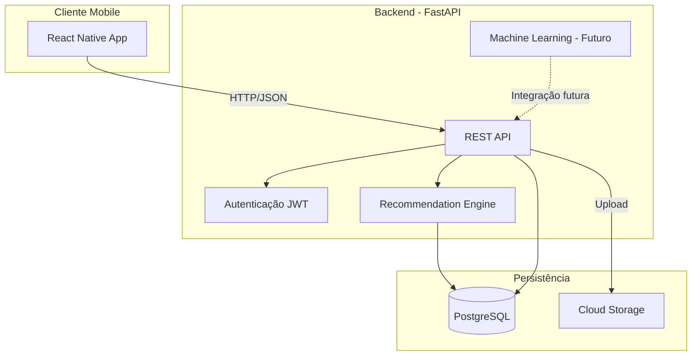
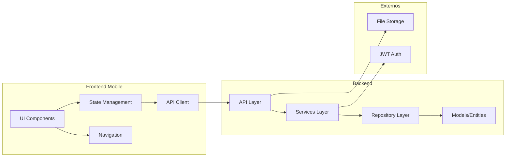
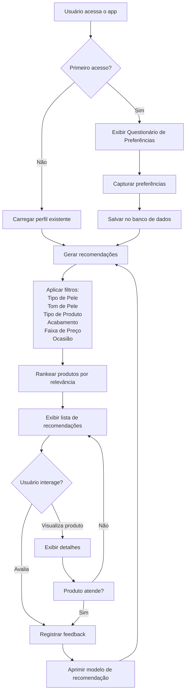
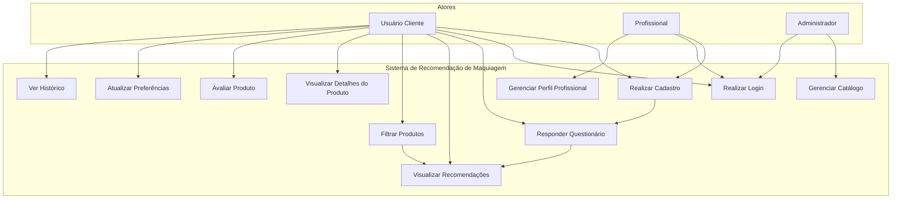
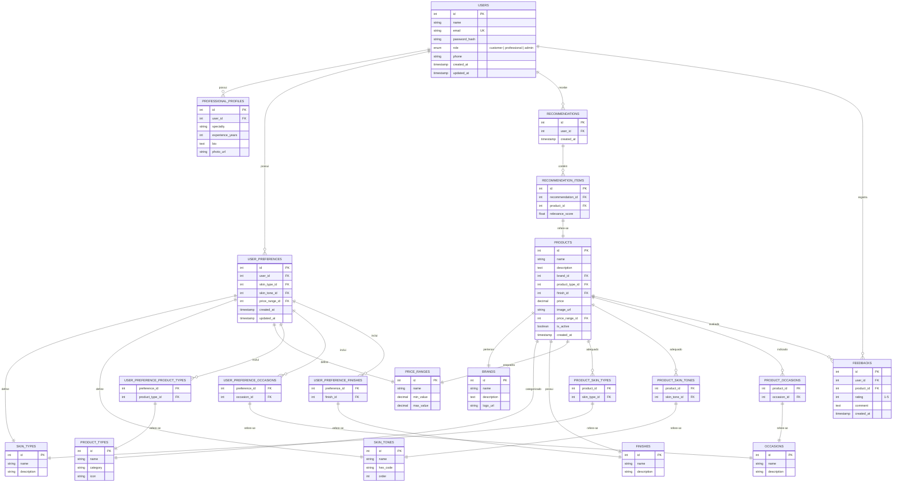
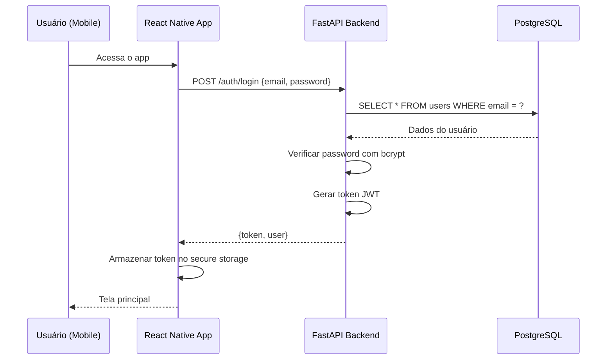
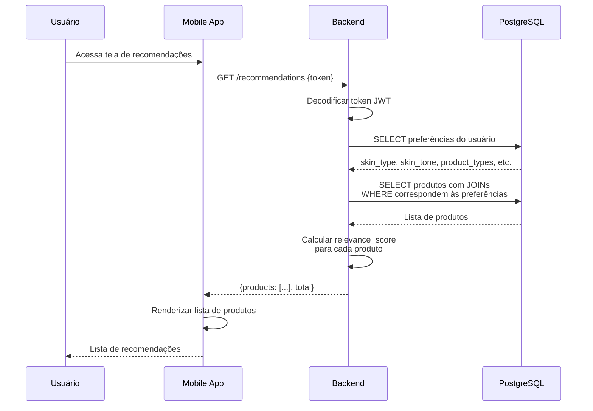
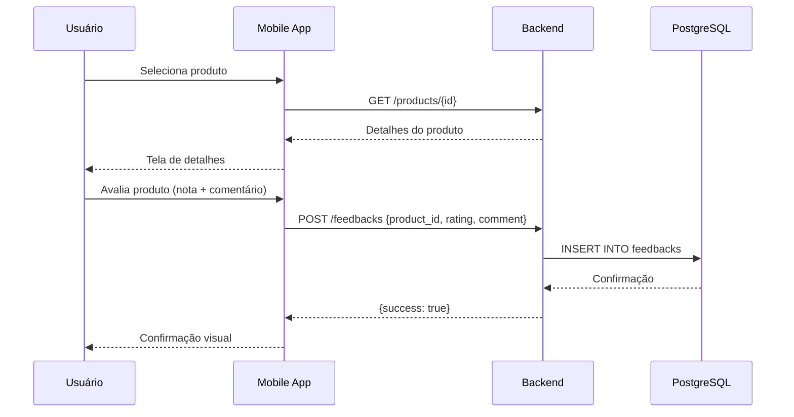

# Documentação do Sistema de Recomendação de Maquiagem

## 1. Introdução

### 1.1 Visão Geral

O **Sistema de Recomendação de Maquiagem** é uma aplicação mobile que tem como objetivo auxiliar clientes e profissionais do ramo de cosméticos a encontrar produtos de maquiagem personalizados de acordo com características individuais. O sistema utiliza um questionário de preferências aplicado no primeiro acesso para capturar informações como tipo de pele, tom de pele, tipo de produto desejado, acabamento, faixa de preço e ocasião de uso, gerando recomendações filtradas e relevantes para cada usuário.

### 1.2 Problema

A vasta quantidade de produtos de maquiagem disponíveis no mercado torna difícil para consumidoras encontrarem opções que atendam especificamente às suas necessidades. A falta de personalização leva a compras inadequadas, desperdício de recursos e insatisfação. Profissionais da área também enfrentam dificuldades para catalogar e sugerir produtos de forma eficiente para suas clientes.

### 1.3 Objetivos

#### Geral
Desenvolver um sistema mobile de recomendação de maquiagem que personalize a experiência de compra com base nas características e preferências individuais de cada usuária.

#### Específicos
- Capturar preferências do usuário por meio de questionário interativo no primeiro acesso
- Implementar mecanismo de filtragem baseado em regras para recomendação de produtos
- Oferecer catálogo categorizado por tipo de produto, pele, ocasião e faixa de preço
- Permitir que profissionais da área gerenciem perfis e recomendem produtos para clientes
- Estabelecer base para evolução futura com recomendações baseadas em análise de imagem

### 1.4 Público-Alvo

- **Cliente final (B2C):** Pessoas que buscam recomendações personalizadas de maquiagem
- **Profissionais:** Maquiadores, consultores de beleza e revendedores que desejam oferecer recomendações embasadas para seus clientes

---

## 2. Stack Tecnológica

| Camada | Tecnologia | Justificativa |
|--------|-----------|---------------|
| **Mobile** | React Native (TypeScript) | Framework cross-platform, permite desenvolvimento simultâneo para iOS e Android com alta performance |
| **Backend** | Python com FastAPI | Framework moderno, assíncrono, alta performance, facilidade para integração futura com bibliotecas de Machine Learning |
| **Banco de Dados** | PostgreSQL | Banco relacional robusto, ideal para dados estruturados de produtos, usuários e preferências |
| **Autenticação** | JWT (JSON Web Tokens) | Autenticação stateless e segura para APIs REST |
| **ORM** | SQLAlchemy + Alembic | Mapeamento objeto-relacional e migrações de banco de dados |
| **Armazenamento** | AWS S3 / Cloud Storage | Imagens de produtos e fotos de usuários |
| **Containerização** | Docker + Docker Compose | Ambiente padronizado de desenvolvimento e implantação |

---

## 3. Arquitetura do Sistema

### 3.1 Diagrama de Arquitetura



### 3.2 Diagrama de Componentes



### 3.3 Fluxo de Recomendação



---

## 4. Requisitos do Sistema

### 4.1 Requisitos Funcionais (RF)

| ID | Descrição | Prioridade |
|----|-----------|-----------|
| RF01 | O sistema deve permitir que usuários realizem cadastro com nome, e-mail e senha | Alta |
| RF02 | O sistema deve autenticar usuários via JWT | Alta |
| RF03 | O sistema deve exibir um questionário de preferências no primeiro acesso do usuário | Alta |
| RF04 | O questionário deve capturar: tipo de pele, tom de pele, tipos de produto de interesse, acabamento preferido, faixa de preço e ocasiões de uso | Alta |
| RF05 | O sistema deve recomendar produtos com base nas preferências cadastradas | Alta |
| RF06 | O sistema deve permitir que o usuário visualize o catálogo completo de produtos | Média |
| RF07 | O sistema deve permitir filtrar produtos por qualquer combinação dos atributos (tipo de pele, tom, tipo de produto, acabamento, preço, ocasião) | Alta |
| RF08 | O sistema deve exibir detalhes do produto incluindo nome, descrição, marca, preço, imagem e avaliações | Alta |
| RF09 | O sistema deve permitir que o usuário avalie produtos com nota (1-5) e comentário | Média |
| RF10 | O sistema deve permitir que profissionais criem perfil com especialidade, experiência e biografia | Média |
| RF11 | O sistema deve ter um painel administrativo para gerenciamento do catálogo de produtos | Alta |
| RF12 | O sistema deve permitir que administradores cadastrem, editem e removam produtos | Alta |
| RF13 | O sistema deve permitir que o usuário atualize suas preferências a qualquer momento | Média |
| RF14 | O sistema deve exibir histórico de recomendações e produtos visualizados | Baixa |
| RF15 | O sistema deve notificar o usuário sobre novos produtos compatíveis com seu perfil | Baixa |

### 4.2 Requisitos Não Funcionais (RNF)

| ID | Descrição | Categoria |
|----|-----------|-----------|
| RNF01 | O sistema deve responder às requisições da API em menos de 2 segundos | Performance |
| RNF02 | O aplicativo mobile deve funcionar offline com dados em cache | Usabilidade |
| RNF03 | As senhas dos usuários devem ser armazenadas com hash bcrypt | Segurança |
| RNF04 | A comunicação entre mobile e backend deve ser criptografada via HTTPS | Segurança |
| RNF05 | O banco de dados deve suportar no mínimo 10.000 produtos cadastrados | Escalabilidade |
| RNF06 | O sistema deve ser responsivo e funcionar em dispositivos iOS e Android | Compatibilidade |
| RNF07 | O código deve seguir padrões RESTful para a API | Padronização |
| RNF08 | O sistema deve registrar logs de erros para monitoramento | Manutenibilidade |
| RNF09 | As imagens dos produtos devem ser otimizadas para carregamento rápido | Performance |
| RNF10 | O sistema deve tratar e exibir mensagens de erro amigáveis ao usuário | Usabilidade |

---

## 5. Casos de Uso

### 5.1 Diagrama de Casos de Uso



### 5.2 Descrição dos Casos de Uso

#### UC01 - Realizar Cadastro

| Campo | Descrição |
|-------|-----------|
| **Ator** | Usuário Cliente, Profissional |
| **Pré-condição** | Não estar autenticado |
| **Fluxo principal** | 1. Usuário acessa tela de cadastro<br/>2. Preenche nome, e-mail e senha<br/>3. Seleciona tipo de perfil (cliente ou profissional)<br/>4. Sistema valida dados e cria conta<br/>5. Sistema redireciona para questionário de preferências |
| **Pós-condição** | Usuário cadastrado e autenticado no sistema |

#### UC02 - Realizar Login

| Campo | Descrição |
|-------|-----------|
| **Ator** | Usuário Cliente, Profissional, Administrador |
| **Pré-condição** | Possuir cadastro ativo |
| **Fluxo principal** | 1. Usuário informa e-mail e senha<br/>2. Sistema valida credenciais<br/>3. Sistema gera token JWT<br/>4. Usuário redirecionado à tela inicial |
| **Pós-condição** | Usuário autenticado no sistema |

#### UC03 - Responder Questionário de Preferências

| Campo | Descrição |
|-------|-----------|
| **Ator** | Usuário Cliente |
| **Pré-condição** | Estar autenticado e ser primeiro acesso |
| **Fluxo principal** | 1. Sistema exibe questionário com etapas:<br/>&nbsp;&nbsp;a) Tipo de pele (oleosa, seca, mista, sensível, acneica)<br/>&nbsp;&nbsp;b) Tom de pele (escala com opções e descrições)<br/>&nbsp;&nbsp;c) Tipos de produto de interesse (base, batom, sombra, etc.)<br/>&nbsp;&nbsp;d) Acabamento preferido (matte, glossy, natural, shimmer, satin)<br/>&nbsp;&nbsp;e) Faixa de preço (econômico, intermediário, premium)<br/>&nbsp;&nbsp;f) Ocasiões de uso (dia a dia, festa, profissional, praia, balada)<br/>2. Usuário seleciona as opções desejadas<br/>3. Sistema salva preferências no banco<br/>4. Sistema redireciona para tela de recomendações |
| **Pós-condição** | Preferências do usuário registradas |

#### UC04 - Visualizar Recomendações

| Campo | Descrição |
|-------|-----------|
| **Ator** | Usuário Cliente |
| **Pré-condição** | Preferências cadastradas |
| **Fluxo principal** | 1. Sistema consulta produtos que correspondem às preferências<br/>2. Aplica ranking por relevância (quantidade de filtros atendidos)<br/>3. Exibe lista de produtos recomendados<br/>4. Usuário pode navegar pela lista |
| **Pós-condição** | Recomendações exibidas |

---

## 6. Modelo de Dados

### 6.1 Diagrama Entidade-Relacionamento (MER)



### 6.2 Dicionário de Dados

#### Tabela: `users`

| Coluna | Tipo | Descrição |
|--------|------|-----------|
| id | SERIAL PK | Identificador único do usuário |
| name | VARCHAR(100) | Nome completo do usuário |
| email | VARCHAR(255) UK | E-mail para login (único) |
| password_hash | VARCHAR(255) | Hash bcrypt da senha |
| role | ENUM | `customer`, `professional`, `admin` |
| phone | VARCHAR(20) | Telefone de contato |
| created_at | TIMESTAMP | Data de criação da conta |
| updated_at | TIMESTAMP | Data da última atualização |

#### Tabela: `products`

| Coluna | Tipo | Descrição |
|--------|------|-----------|
| id | SERIAL PK | Identificador único do produto |
| name | VARCHAR(200) | Nome do produto |
| description | TEXT | Descrição detalhada do produto |
| brand_id | INT FK | Marca do produto |
| product_type_id | INT FK | Tipo/categoria do produto |
| finish_id | INT FK | Acabamento do produto |
| price | DECIMAL(10,2) | Preço do produto |
| image_url | VARCHAR(500) | URL da imagem do produto |
| price_range_id | INT FK | Faixa de preço |
| is_active | BOOLEAN | Se o produto está ativo no catálogo |
| created_at | TIMESTAMP | Data de cadastro |

#### Tabela: `user_preferences`

| Coluna | Tipo | Descrição |
|--------|------|-----------|
| id | SERIAL PK | Identificador único |
| user_id | INT FK | Usuário dono da preferência |
| skin_type_id | INT FK | Tipo de pele selecionado |
| skin_tone_id | INT FK | Tom de pele selecionado |
| price_range_id | INT FK | Faixa de preço selecionada |
| created_at | TIMESTAMP | Data de criação |
| updated_at | TIMESTAMP | Data da última atualização |

---

## 7. Fluxos Detalhados do Sistema

### 7.1 Fluxo de Autenticação



### 7.2 Fluxo de Recomendação



### 7.3 Fluxo de Avaliação de Produto



---

## 8. API REST (Endpoints)

### 8.1 Autenticação

| Método | Rota | Descrição |
|--------|------|-----------|
| POST | `/api/auth/register` | Cadastro de usuário |
| POST | `/api/auth/login` | Login e retorno de token JWT |
| POST | `/api/auth/refresh` | Renovar token de acesso |

### 8.2 Usuário e Perfil

| Método | Rota | Descrição |
|--------|------|-----------|
| GET | `/api/users/me` | Dados do usuário logado |
| PUT | `/api/users/me` | Atualizar dados do perfil |
| GET | `/api/users/me/preferences` | Obter preferências do usuário |
| PUT | `/api/users/me/preferences` | Atualizar preferências |
| GET | `/api/users/me/history` | Histórico de recomendações |

### 8.3 Produtos

| Método | Rota | Descrição |
|--------|------|-----------|
| GET | `/api/products` | Listar produtos (com filtros opcionais) |
| GET | `/api/products/{id}` | Detalhes do produto |
| GET | `/api/products/recommended` | Produtos recomendados para o usuário |

### 8.4 Catálogo e Filtros

| Método | Rota | Descrição |
|--------|------|-----------|
| GET | `/api/skin-types` | Listar tipos de pele |
| GET | `/api/skin-tones` | Listar tons de pele |
| GET | `/api/product-types` | Listar tipos de produto |
| GET | `/api/finishes` | Listar acabamentos |
| GET | `/api/occasions` | Listar ocasiões |
| GET | `/api/price-ranges` | Listar faixas de preço |
| GET | `/api/brands` | Listar marcas |

### 8.5 Avaliações

| Método | Rota | Descrição |
|--------|------|-----------|
| POST | `/api/feedbacks` | Registrar avaliação |
| GET | `/api/products/{id}/feedbacks` | Listar avaliações de um produto |

### 8.6 Administrativo

| Método | Rota | Descrição |
|--------|------|-----------|
| POST | `/api/admin/products` | Cadastrar produto |
| PUT | `/api/admin/products/{id}` | Editar produto |
| DELETE | `/api/admin/products/{id}` | Remover produto |
| POST | `/api/admin/brands` | Cadastrar marca |
| PUT | `/api/admin/brands/{id}` | Editar marca |

---

## 9. Estrutura de Diretórios (Projeto)

```
sistema-recomendacao-maquiagem/
├── mobile/                          # Aplicação React Native
│   ├── src/
│   │   ├── screens/                 # Telas do aplicativo
│   │   │   ├── Auth/               # Login e Cadastro
│   │   │   ├── Onboarding/         # Questionário de preferências
│   │   │   ├── Home/               # Tela inicial com recomendações
│   │   │   ├── Catalog/            # Catálogo completo
│   │   │   ├── ProductDetail/      # Detalhes do produto
│   │   │   ├── Profile/            # Perfil do usuário
│   │   │   └── Professional/       # Perfil profissional
│   │   ├── components/             # Componentes reutilizáveis
│   │   ├── services/               # Serviços de API
│   │   ├── hooks/                  # Custom hooks
│   │   ├── navigation/             # Configuração de navegação
│   │   ├── store/                  # Gerenciamento de estado
│   │   ├── utils/                  # Utilitários
│   │   └── types/                  # Tipos TypeScript
│   ├── android/
│   ├── ios/
│   ├── package.json
│   └── tsconfig.json
│
├── backend/                         # API FastAPI (Python)
│   ├── app/
│   │   ├── api/                    # Rotas da API
│   │   │   ├── v1/
│   │   │   │   ├── auth.py
│   │   │   │   ├── users.py
│   │   │   │   ├── products.py
│   │   │   │   ├── recommendations.py
│   │   │   │   ├── catalog.py
│   │   │   │   └── admin.py
│   │   ├── core/                   # Configurações centrais
│   │   │   ├── config.py
│   │   │   ├── security.py
│   │   │   └── database.py
│   │   ├── models/                 # Modelos SQLAlchemy
│   │   │   ├── user.py
│   │   │   ├── product.py
│   │   │   ├── preference.py
│   │   │   └── recommendation.py
│   │   ├── schemas/                # Schemas Pydantic
│   │   ├── services/               # Lógica de negócio
│   │   │   ├── recommendation_engine.py
│   │   │   └── ... 
│   │   ├── repositories/           # Camada de dados
│   │   └── migrations/             # Migrações Alembic
│   ├── tests/
│   ├── requirements.txt
│   ├── Dockerfile
│   └── alembic.ini
│
├── docs/                            # Documentação
│   └── documentacao-sistema.md
│
├── docker-compose.yml
└── README.md
```

---

## 10. Algoritmo de Recomendação (Versão Inicial)

### 10.1 Recomendação Baseada em Regras

Na versão inicial, o sistema utilizará um algoritmo de recomendação baseado em regras (filtragem baseada em conteúdo), onde cada produto recebe uma pontuação de relevância de acordo com quantos critérios do perfil do usuário ele atende.

#### Cálculo de Relevância

```
Para cada produto P e preferências do usuário U:

score = 0
score += 1.0  se P.skin_type_id == U.skin_type_id (combinação exata de pele)
score += 1.0  se P.skin_tone_id == U.skin_tone_id (combinação exata de tom)
score += 0.8  se P.product_type_id está em U.product_types
score += 0.7  se P.finish_id está em U.finishes
score += 0.6  se P.price_range_id == U.price_range_id
score += 0.5  se P.occasion_id está em U.occasions

Score máximo possível: 4.6
Score normalizado: score / 4.6 * 100

Produtos são ordenados do maior score para o menor.
```

### 10.2 Evolução Futura (Machine Learning)

Conforme mencionado, o sistema poderá evoluir para utilizar:

- **K-Means Clustering:** Agrupar usuários com perfis similares para recomendações colaborativas
- **Classificação de imagem:** Identificar tom de pele a partir de foto enviada pela usuária
- **Filtragem híbrida:** Combinar conteúdo e colaboração para recomendações mais precisas

---

## 11. Considerações de Segurança

- Autenticação via JWT com tokens de acesso (15min) e refresh (7 dias)
- Senhas armazenadas com bcrypt (salt rounds = 12)
- HTTPS obrigatório em produção
- Validação de dados de entrada com Pydantic (backend) e Zod (mobile)
- Rate limiting nas rotas de autenticação para prevenir ataques de força bruta
- Sanitização de inputs para prevenir SQL Injection (via ORM)
- Permissões baseadas em role (customer, professional, admin)

---

## 12. Cronograma (Sugestão)

| Fase | Atividades | Duração Estimada |
|------|-----------|------------------|
| **1. Planejamento** | Documentação, prototipação, modelagem | 2 semanas |
| **2. Setup** | Configuração do ambiente, banco de dados, estrutura do projeto | 1 semana |
| **3. Backend Core** | Modelos, API, autenticação, CRUD de produtos | 3 semanas |
| **4. Mobile Core** | Navegação, telas de autenticação, onboarding | 3 semanas |
| **5. Recomendação** | Implementação do motor de recomendação | 2 semanas |
| **6. Integração** | Integração mobile-backend, testes | 2 semanas |
| **7. Testes** | Testes funcionais, de usabilidade e correções | 2 semanas |
| **8. Documentação Final** | Relatório TCC, manual do usuário | 1 semana |

---

## 13. Trabalhos Futuros

- **Recomendação por foto:** Implementar análise de imagem para detectar tom de pele automaticamente
- **Chatbot integrado:** Assistente virtual para tirar dúvidas sobre produtos
- **Moda sazonal:** Recomendações baseadas em estações do ano e tendências
- **Realidade aumentada:** Prova virtual de produtos (try-on) via câmera
- **Integração com e-commerce:** Link direto para compra dos produtos recomendados
- **Sistema de pontos:** Gamificação para incentivar avaliações e engajamento

---

## 14. Referências

- Material presente na pasta do projeto (artigos acadêmicos sobre sistemas de recomendação, maquiagem e clusterização K-Means)
- FastAPI Documentation: https://fastapi.tiangolo.com/
- React Native Documentation: https://reactnative.dev/
- SQLAlchemy Documentation: https://www.sqlalchemy.org/
